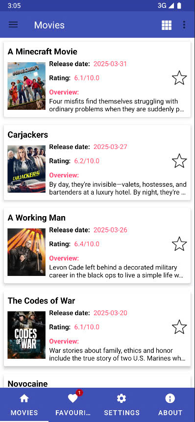
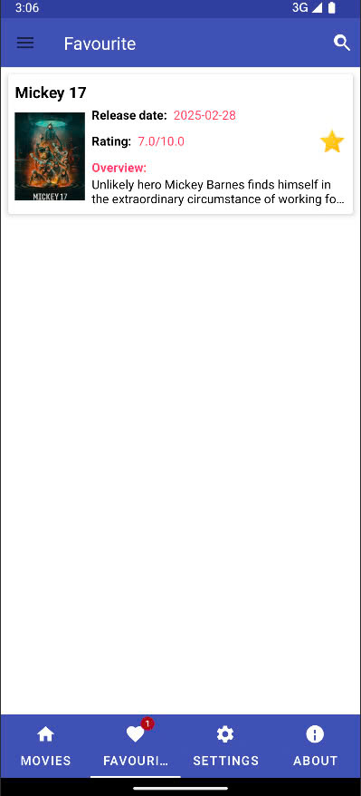
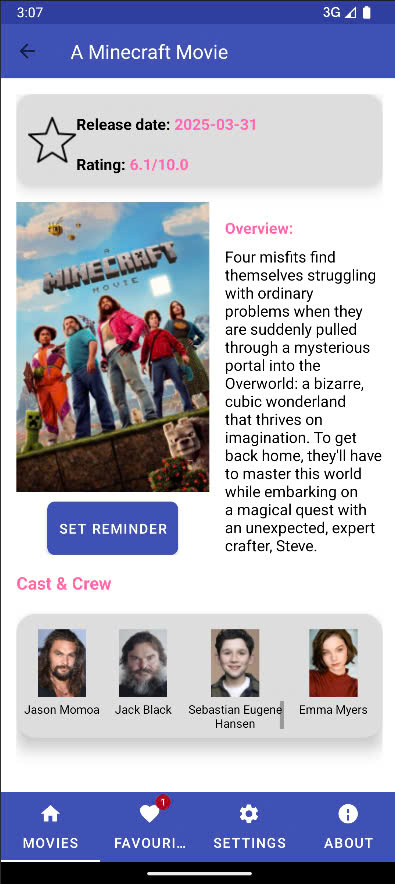
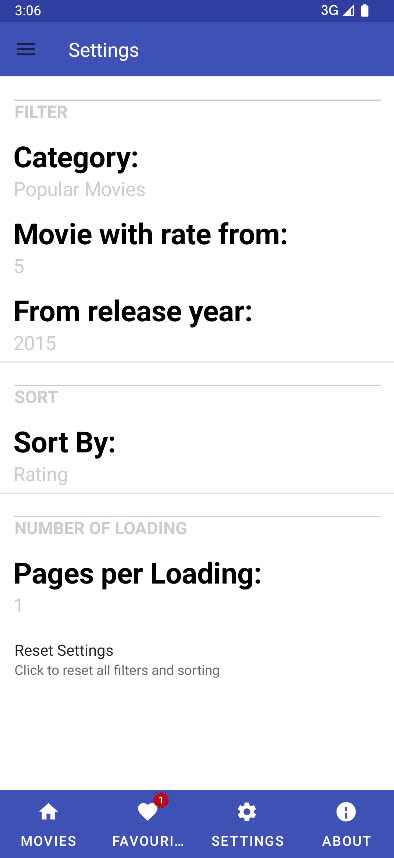
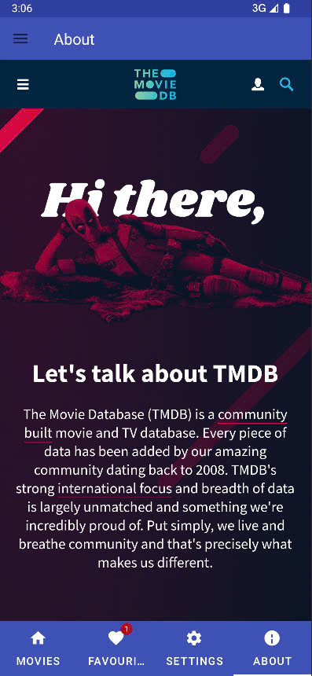
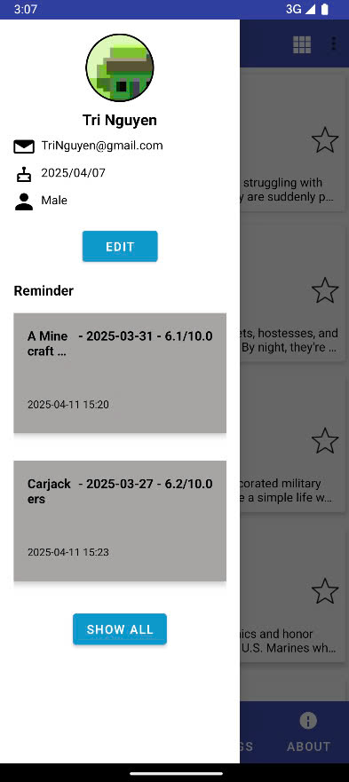
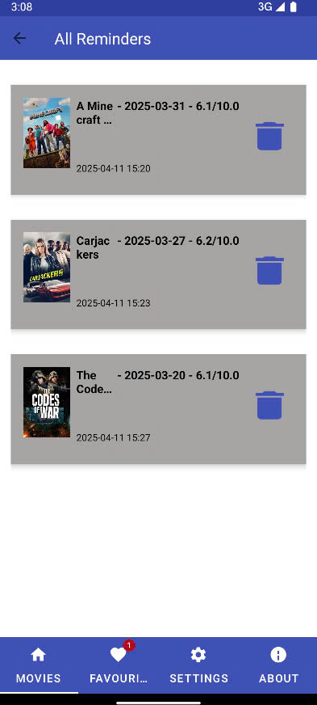

# 🎬 MovieApp Android (Java)

MovieApp là một ứng dụng Android hiển thị danh sách phim từ API, cho phép người dùng xem chi tiết phim, đánh dấu yêu thích, cài đặt nhắc nhở, cập nhật hồ sơ cá nhân và tùy chỉnh cài đặt hiển thị. Ứng dụng được xây dựng theo kiến trúc **Clean Architecture**, sử dụng nhiều thư viện mạnh mẽ như Retrofit, RxJava, Room, Firebase và WorkManager.

---

## 📱 Tính năng nổi bật

- Hiển thị danh sách phim (Popular, Top Rated, Upcoming, Now Playing) từ [TheMovieDB API](https://www.themoviedb.org/)
- Xem chi tiết phim, dàn diễn viên, thời gian phát hành, điểm đánh giá
- Đánh dấu phim yêu thích (Room Database)
- Cài đặt nhắc nhở xem phim với thông báo (WorkManager + Notification)
- Đăng ký/Cập nhật hồ sơ cá nhân (Firebase)
- Cài đặt bộ lọc phim, sắp xếp và phân trang dữ liệu (SharedPreferences)
- Hỗ trợ hiển thị danh sách dạng List/Grid, kéo để làm mới và tải thêm
- Giao diện hiện đại, dễ sử dụng, sử dụng DataBinding và Navigation Component

---

## 🧱 Kiến trúc

Ứng dụng tuân thủ nguyên tắc **Clean Architecture**:

```
data/
├── custom/               // Preference UI tùy chỉnh
├── local/
│   ├── dao/              // DAO cho Room (Movie, Reminder)
│   ├── database/         // AppDatabase cấu hình Room
│   ├── entity/           // Entity cho Room (MovieEntity, ReminderEntity)
│   └── mapper/           // Mapper chuyển đổi dữ liệu giữa Entity và Domain
├── module/               // Hilt module cho data layer
├── paging/               // PagingSource cho danh sách phim & diễn viên
├── remote/
│   ├── api/              // Retrofit client và API service
│   └── model/            // Data model từ API response
└── repository/           // Repository implementation giao tiếp giữa data & domain

domain/
├── model/                // Domain models (Movie, Reminder, Profile,...)
├── module/               // Hilt module cho domain layer
├── repository/           // Interface Repository (Dependency Inversion)
└── usecase/              // Các UseCases tương ứng với chức năng cụ thể

presentation/
├── adapter/              // RecyclerView adapters
├── ui/
│   ├── about/            // Màn hình About
│   ├── main/             // MainActivity, MainViewModel
│   ├── moviedetails/     // Chi tiết phim
│   ├── movielist/        // Danh sách phim
│   ├── profile/          // Chỉnh sửa hồ sơ người dùng
│   ├── reminders/        // Danh sách nhắc nhở
│   ├── settings/         // Cài đặt ứng dụng
│   └── splash/           // Màn hình Splash
├── worker/               // ReminderWorker với WorkManager
└── MyApplication         // Ứng dụng chính (kích hoạt Hilt, Firebase,...)

```

---

## 🔧 Công nghệ sử dụng

| Chức năng              | Thư viện                              |
|------------------------|----------------------------------------|
| Networking             | Retrofit + RxJava                     |
| JSON Parser            | Gson                                  |
| Local Storage          | Room (Favorites, Reminders)           |
| Image Loading          | Picasso                               |
| Navigation             | Jetpack Navigation Component          |
| UI Binding             | DataBinding (Two-way)                 |
| Background Tasks       | WorkManager                           |
| State Management       | ViewModel + LiveData                  |
| Pagination             | Paging 3                              |
| User Profile           | Firebase Auth + Firebase Storage      |
| Settings               | SharedPreferences                     |

---

## 🔗 API sử dụng (TheMovieDB)

| Chức năng              | URL |
|------------------------|-----|
| Get Config             | `/configuration` |
| Get Movies (Popular)   | `/movie/popular` |
| Get Movies (Top Rated) | `/movie/top_rated` |
| Get Movies (Upcoming)  | `/movie/upcoming` |
| Get Movies (Now Playing)| `/movie/now_playing` |
| Get Movie Details      | `/movie/{movieId}` |
| Get Cast & Crew        | `/movie/{movieId}/credits` |
| Search Movie           | `/search/movie` |
| Get Image              | `https://image.tmdb.org/t/p/{size}/{path}` |

---

## 🖼️ Giao diện chính

### ActionBar
- Hiển thị loại phim hiện tại
- Nút chuyển đổi giữa dạng list/grid
- Menu chọn loại phim (Popular, Top Rated, etc.)

### RecyclerView (List/Grid)
- Kéo xuống để làm mới (pull-to-refresh)
- Kéo lên để tải thêm (pagination)
- Hiển thị thông tin: tiêu đề, poster, ngày phát hành, điểm đánh giá, icon người lớn, icon yêu thích

### Tablayout (4 Tabs)
- 🎬 Movies
- ❤️ Favourite (có badge số lượng)
- ⚙️ Settings
- ℹ️ About

### Sidebar (DrawerLayout)
- Hồ sơ người dùng (avatar, tên, email, sinh nhật, giới tính)
- Danh sách nhắc nhở (Reminders)

### Chi tiết phim
- Poster, tiêu đề, mô tả, điểm đánh giá, ngày phát hành
- Danh sách diễn viên (horizontal RecyclerView)
- Nút nhắc nhở với DateTimePicker + Thông báo

### Cài đặt (Settings)
- Bộ lọc: loại phim, điểm đánh giá, năm phát hành
- Sắp xếp: theo ngày phát hành
- Số trang mỗi lần tải

### Màn hình About
- Hiển thị WebView: [https://www.themoviedb.org/about/our-history](https://www.themoviedb.org/about/our-history)

---

## 🚀 Cài đặt

1. Clone repo:
```bash
git clone [https://github.com/yourusername/MovieApp.git](https://github.com/ThanhTriIsCoding/movie_App.git)
```

2. Thêm API Key vào `local.properties`:
```properties
TMDB_API_KEY=e7631ffcb8e766993e5ec0c1f4245f93
```

3. Sync project và chạy!

---

## 📸 Screenshot

### 🏠 Home - Movie List (Popular / Top Rated / Upcoming / Now Playing)


---

### ❤️ Favourite - Danh sách phim yêu thích


---

### 📄 Movie Detail - Thông tin chi tiết phim


---

### ⚙️ Settings - Cài đặt bộ lọc và sắp xếp


---

### ℹ️ About - Giới thiệu ứng dụng


---

### 👤 Profile - Hồ sơ người dùng (avatar, tên, email,...)


---

### 📝 Edit Profile - Chỉnh sửa hồ sơ cá nhân


---

### ⏰ Reminders - Danh sách phim đã cài nhắc nhở



---

## 🧑‍💻 Tác giả

> Developed by [ThanhTriIsCoding]([https://github.com/yourusername](https://github.com/ThanhTriIsCoding))  
> Contact: nttri.10a1cl2@gmail.com

---

